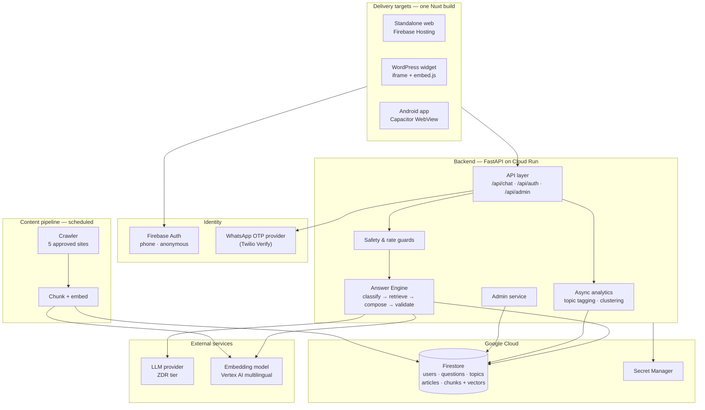

# **Technical Design Document (TDD)**

**Project:** Tanya Iman \- Grounded Answer Architecture

**Version:** 1.0

**Date:** August 2026

---

## **1\. System Architecture Overview**

Tanya Iman is a **static frontend over a stateless answer service backed by a grounded retrieval corpus**. Three properties drive the whole design:

1. **The frontend must be a static artefact**, because the same build has to be served from a CDN, embedded in an iframe, and packaged into an Android binary. No server-rendered HTML at request time.
2. **The answer path must be deterministic where it matters.** Content rules F-11 to F-15 are not prompt suggestions; they are validators that run after generation and can reject a model's output.
3. **Nothing enters an answer that did not come from the crawled corpus.** Retrieval is not an optimisation for quality — it is the mechanism by which the product's central promise is kept. The allowlist starts at five sites and is designed to grow (F-41 – F-43).



---

## **2\. Core Components**

### **2.1 Frontend applications**

Two Nuxt 3 applications in SPA mode (`ssr: false`), built to static output with `nuxt generate`. Full rationale in [Frontend Framework Decision — Nuxt](frontend-framework-decision-nuxt.md).

| App | Path | Hosting | Build artefact |
|---|---|---|---|
| Seeker app | `web/app/` | Firebase Hosting; iframed by WordPress; bundled by Capacitor | `.output/public` |
| Admin portal | `web/admin/` | Firebase Hosting (separate site) | `.output/public` |
| Shared client | `web/shared/` | — | Consumed as a workspace package |

Neither app talks to Firestore directly. All reads and writes go through the backend API, so that access control, validation, and rate limiting exist in exactly one place. The only direct client-to-Google call is Firebase Auth token acquisition.

---

### **2.2 Backend service**

* **Runtime:** Python 3.12, FastAPI, Uvicorn, deployed to Cloud Run. Dependencies managed with **`uv`**.
* **Statelessness:** No in-process session state. Rate-limit windows, sessions, and conversation history are in Firestore, so Cloud Run can scale to zero and back without behaviour change.
* **Layering:**

  | Layer | Responsibility | Location |
  |---|---|---|
  | Routers | HTTP surface, request/response schemas, auth dependency | `backend/routers/` |
  | Services | Business logic — sessions, likes, topics, ingestion | `backend/services/` |
  | Engine | The answer pipeline and its nodes | `backend/engine/` |
  | Storage | Firestore access; the only module that imports the Firestore SDK | `backend/storage/` |
  | Providers | LLM, embeddings, OTP — each behind an interface | `backend/providers/` |

The **providers** layer exists specifically to satisfy risk R5. Swapping the LLM or the OTP vendor must touch one adapter and its tests, and nothing in `services/` or `engine/`.

---

### **2.3 Identity & session**

Three sign-in paths produce one thing: a Firebase ID token that the backend verifies on every request.

| Path | Mechanism | Resulting identity |
|---|---|---|
| **Guest** (F-3) | Firebase Anonymous Auth, client-side | `auth_method: guest`, no phone number stored |
| **SMS** (F-2) | Firebase Phone Auth. Web uses the JS SDK; Android uses `@capacitor-firebase/authentication` for Play-Services-backed SMS retrieval | `auth_method: sms`, phone stored encrypted |
| **WhatsApp** (F-2) | Backend calls the OTP provider to send and verify a code, then mints a **Firebase custom token** for that phone number and returns it to the client, which exchanges it for an ID token | `auth_method: whatsapp`, phone stored encrypted |

The WhatsApp path needs the custom-token detour because Firebase Auth issues OTPs over SMS only. Both OTP paths converge on the same Firebase UID space, so the rest of the system does not care which channel a user came from.

**Session model.** A session is a conversation on one device. It is created on first question, carries the last N turns used for multi-turn context (F-8), and expires after 24 hours of inactivity. Sessions belong to a user; a Guest user is a real user record with `auth_method: guest`.

**Guest conversion** (F-25). When a Guest signs in with a phone number, the backend links the anonymous UID's sessions and questions to the resulting phone UID and marks the anonymous record superseded. This is a server-side merge, not a client-side re-post, so the on-screen conversation survives.

---

### **2.4 Safety and rate guards**

These run **before** the answer engine and cannot be reached around. They are deterministic Python, never LLM calls, so they cost nothing and cannot be prompt-injected.

| Guard | Requirement | Behaviour on trip |
|---|---|---|
| **Crisis guard** | F-30 – F-32 | Returns a pre-approved script from `backend/config/crisis_scripts.id.yml`. No retrieval, no generation. Event recorded with `is_crisis: true` and excluded from topic analytics |
| **Rate limiter** | F-16 | 30 messages per rolling hour per Firebase UID, enforced with a Firestore transactional counter keyed `{uid}:{hour_bucket}`. Returns HTTP 429 with `retry_after_seconds` |
| **OTP throttle** | F-24 | 3 code requests per number per hour, 5 verification attempts per code |
| **Input bounds** | — | Rejects empty input and input over 1,000 characters before anything else runs |

The crisis guard runs first, ahead of the rate limiter. A person in crisis who has hit their message limit still gets the helpline.

---

### **2.5 The Answer Engine**

Summarised here; specified in full in [AI Answer Engine Specification](ai-answer-engine-specification.md).

The engine is a fixed pipeline, not an agent. There is no tool-calling loop and no state machine, because the product does not need the model to make decisions about flow — it needs the model to write one well-grounded paragraph under supervision.

```
Question (post-guards)
  → Relevance_Classifier   — theology / faith-related, or refuse (F-9, F-10)
  → Topic_Resolver         — map to one of 13 topics + `lainnya`
  → Curated_Answer_Resolver— if the topic has an approved curated answer, return it (F-23)
  → Retriever              — vector search over article_chunks, top-k with threshold
      └─ nothing above threshold → no-grounding response (F-29)
  → Answer_Composer        — LLM writes the answer from retrieved passages only (F-15)
  → Compliance_Validator   — F-11 word count, F-12 terminology, F-13 scripture balance,
                             F-14 citations, F-15 grounding
      └─ fail → one repair attempt → fail again → fallback response, log for admin (F-28)
  → Response_Assembler     — attach 1–2 article links, persist, return
```

Two properties matter architecturally:

* **The validator is the authority, not the prompt.** A model that ignores an instruction produces a rejected answer, not a shipped one. This is what makes K4 = 100% achievable rather than aspirational.
* **Curated answers short-circuit generation.** When the editorial team has written the answer for a topic, it is served verbatim. This gives the ministry a lever that does not require an engineer.

---

### **2.6 Retrieval subsystem**

* **Store:** Firestore vector search (`find_nearest`) over the `article_chunks` collection. Keeping vectors in the same database as everything else removes a whole system from the deployment, the backup story, and the failure surface. If measured recall or latency proves inadequate at corpus scale, the retriever interface allows a swap to Vertex AI Vector Search without touching the engine.
* **Embeddings:** Vertex AI `text-multilingual-embedding-002`, chosen for Indonesian quality. The same model must embed both chunks and queries; the model identifier is stored on every chunk so that a model change forces a detectable re-index rather than silently degrading recall.
* **Chunking:** ~400 token windows with ~80 token overlap, split on heading and paragraph boundaries so a chunk rarely straddles a topic change. Each chunk keeps its article's title and URL denormalised, so a citation can be produced without a second read.
* **Query:** top-k = 8 retrieved, re-ranked, top 4 passed to the composer. Chunks below the similarity threshold are dropped; if fewer than 2 survive, the engine takes the no-grounding path (F-29).
* **Allowlist enforcement:** the retriever filters on `site in APPROVED_SITES` at query time even though the crawler already enforces it at write time. Two independent gates, because F-15 is the product's core promise.

---

### **2.7 Analytics subsystem**

Runs asynchronously after the response is returned, so it never sits in the user's latency budget.

| Job | Requirement | Approach |
|---|---|---|
| **Topic tagging** | F-21 | The topic resolved during answering is persisted on the question record. Questions the resolver could not place go to `lainnya` |
| **Similar-question clustering** | F-22 | Each question's embedding is compared to existing cluster centroids. Above the similarity threshold it joins the cluster and increments its count; otherwise it seeds a new cluster with its own text as the canonical phrasing. Centroids are recomputed nightly |
| **Content-gap tracking** | F-29, US-8 | No-grounding questions are written to a dedicated view for the editorial team |
| **Aggregate counters** | F-18, F-21 | Per-topic question and like counters are maintained with Firestore distributed counters, not read-modify-write, so concurrent likes do not contend |

---

### **2.8 Admin layer**

The admin portal is a read-heavy analytics surface plus a small number of high-consequence writes.

**Authentication** is entirely separate from end-user auth (F-19):

* JWT issued by the backend, signed with `ADMIN_JWT_SECRET`. Access token 1 hour; refresh token 30 days, stored hashed.
* Accounts are created only by an existing `super_admin`. There is no self-registration and no shared password.
* Role-based access enforced in the route dependency **and** re-checked in the service layer, satisfying PRD §7.4's requirement that access control not live only in the UI.

| Role | Permissions |
|---|---|
| `editor` | Read questions, topics, clusters, gaps. Create and edit curated answers |
| `reviewer` | Read-only across all analytics views. Export CSV |
| `super_admin` | Everything, plus admin account management, system config, and deletion |

**Audit log** (F-37): every `DELETE`, every curated-answer change, and every config change writes an `admin_audit_log` entry **before** the action executes. If the action fails, no entry is committed.

---

### **2.9 Content ingestion pipeline**

A scheduled job, not part of the request path. Operational detail in [Content Ingestion & RAG Runbook](content-ingestion-and-rag-runbook.md).

```
Sitemap / crawl of the 5 approved sites
  → Fetch (respecting robots.txt and a politeness delay)
  → Extract main content, strip navigation and boilerplate
  → Detect change via content hash; unchanged articles are skipped
  → Chunk
  → Embed
  → Upsert articles + article_chunks
  → Retire chunks whose parent article disappeared
```

Runs weekly by default via Cloud Scheduler, and on demand from the admin portal. The job is idempotent: re-running it over an unchanged corpus performs no writes and costs nothing but a few HTTP requests.

---

## **3\. Data Model**

Firestore, in the project's default database. Collection-level detail below; the product's view of the same model is PRD §10.

### **3.1 `users`**

| Field | Type | Notes |
|---|---|---|
| `uid` | string | Document ID. Firebase UID |
| `auth_method` | enum | `sms` \| `whatsapp` \| `guest` |
| `phone_e164_enc` | string \| null | AES-GCM encrypted; null for guests |
| `phone_hash` | string \| null | HMAC of the E.164 number, for lookup without decryption |
| `created_at` | timestamp | |
| `last_active_at` | timestamp | Updated on every question |
| `superseded_by` | string \| null | Set on the anonymous record after guest conversion (F-25) |
| `question_count` | int | Denormalised lifetime count |

### **3.2 `sessions`**

| Field | Type | Notes |
|---|---|---|
| `id` | string | Document ID |
| `uid` | string | Owner |
| `platform` | enum | `web` \| `widget` \| `android` |
| `embed_origin` | string \| null | Host page for widget sessions (F-38 attribution) |
| `started_at` / `last_message_at` | timestamp | |
| `message_count` | int | |
| `expires_at` | timestamp | 24h after `last_message_at`; Firestore TTL policy |

### **3.3 `questions`**

The analytics spine. Denormalised deliberately — this collection is queried by admins across filters and must not require joins.

| Field | Type | Notes |
|---|---|---|
| `id` | string | Document ID |
| `session_id`, `uid` | string | |
| `question_text` | string | As typed |
| `answer_text` | string \| null | Null for refusals and crisis responses |
| `answer_source` | enum | `curated` \| `generated` \| `refusal` \| `no_grounding` \| `crisis` \| `error` |
| `topic_slug` | string \| null | One of the 13 topics or `lainnya` |
| `cluster_id` | string \| null | Assigned by the clustering job (F-22) |
| `citations` | array | 1–2 objects: `{article_id, title, url, site}` |
| `retrieved_chunk_ids` | array | For audit and grounding review |
| `like_count` | int | Denormalised (F-18) |
| `is_refused`, `is_crisis`, `has_grounding` | bool | Admin filters (F-35) |
| `validator_failures` | array | Rule codes that failed before repair; empty on a clean pass |
| `model`, `prompt_version` | string | Which model and prompt produced this answer |
| `latency_ms` | int | For K5 |
| `created_at` | timestamp | |
| `question_embedding` | vector(768) | For clustering |

Composite indexes are required on `(created_at desc)`, `(topic_slug, created_at desc)`, `(is_refused, created_at desc)`, and `(has_grounding, created_at desc)` to serve the admin filters at scale.

### **3.4 `likes`**

| Field | Type | Notes |
|---|---|---|
| `id` | string | `{uid}_{question_id}` — makes the like idempotent by construction (F-33) |
| `uid`, `question_id`, `topic_slug` | string | |
| `created_at` | timestamp | |

### **3.5 `topics`**

| Field | Type | Notes |
|---|---|---|
| `slug` | string | Document ID |
| `name_id`, `name_en` | string | Indonesian is what users and admins see |
| `curated_answer` | string \| null | Editor-authored; overrides generation when present (F-23) |
| `curated_citations` | array | 1–2 article references shown with the curated answer |
| `curated_status` | enum | `draft` \| `published` — only `published` is served |
| `updated_by`, `updated_at` | string / timestamp | |
| `question_count`, `like_count` | int | Distributed counters |

### **3.6 `articles`**

| Field | Type | Notes |
|---|---|---|
| `id` | string | Stable hash of the canonical URL |
| `site` | enum | One of the five approved domains |
| `url`, `title` | string | |
| `published_at` | timestamp \| null | |
| `summary` | string | Used in admin views and for topic assignment |
| `topic_slugs` | array | |
| `content_hash` | string | Change detection |
| `first_seen_at`, `last_crawled_at` | timestamp | |
| `status` | enum | `active` \| `retired` |

### **3.7 `article_chunks`**

| Field | Type | Notes |
|---|---|---|
| `id` | string | `{article_id}#{chunk_index}` |
| `article_id`, `site`, `url`, `title` | string | Denormalised for citation without a second read |
| `chunk_index` | int | |
| `text` | string | |
| `embedding` | vector(768) | Vector index for `find_nearest` |
| `embedding_model` | string | Forces a detectable re-index on model change |
| `token_count` | int | |

### **3.8 `question_clusters`**

| Field | Type | Notes |
|---|---|---|
| `id` | string | |
| `canonical_text` | string | The first question that seeded the cluster, or an editor override |
| `centroid` | vector(768) | Recomputed nightly |
| `topic_slug` | string | Majority topic among members |
| `member_count` | int | The number surfaced by F-22 |
| `first_seen_at`, `last_seen_at` | timestamp | |

### **3.9 `admin_users`, `admin_audit_log`, `system_config`**

| `admin_users` | Type | Notes |
|---|---|---|
| `id` | string | UUID |
| `email` | string | Unique; login identity |
| `password_hash` | string | bcrypt |
| `role` | enum | `editor` \| `reviewer` \| `super_admin` |
| `refresh_token_hash` | string \| null | |
| `created_at`, `last_login_at` | timestamp | |

| `admin_audit_log` | Type | Notes |
|---|---|---|
| `id` | string | UUID |
| `admin_id` | string | |
| `action` | string | `UPDATE_CURATED_ANSWER`, `DELETE_QUESTION`, `UPDATE_CONFIG`, `RUN_INGESTION` |
| `target_id` | string | Topic slug, question ID, or config key |
| `detail` | string | Human-readable, including the before value where relevant |
| `created_at` | timestamp | |

| `system_config` | Type | Notes |
|---|---|---|
| `key` | string | Document ID — e.g. `retention_months`, `rate_limit_per_hour`, `similarity_threshold` |
| `value` | string | |
| `updated_by`, `updated_at` | string / timestamp | |

Seed values: `retention_months = 12`, `rate_limit_per_hour = 30`, `similarity_threshold = 0.72`.

---

## **4\. API Surface**

### **4.1 Public routes**

All require a valid Firebase ID token except `/api/health`.

| Method | Route | Description |
|---|---|---|
| `POST` | `/api/auth/otp/request` | Body `{channel: "sms"\|"whatsapp", phone}`. WhatsApp dispatches via the OTP provider; SMS is handled client-side by Firebase and this route is used only for throttle accounting |
| `POST` | `/api/auth/otp/verify` | Body `{phone, code}`. Returns a Firebase custom token on success |
| `POST` | `/api/auth/convert` | Links an anonymous UID's data to a phone UID (F-25) |
| `POST` | `/api/chat/sessions` | Creates a session; returns `session_id` |
| `POST` | `/api/chat/ask` | Body `{session_id, text}`. The single answer endpoint. Returns the answer, citations, `question_id`, and `answer_source` |
| `POST` | `/api/chat/answers/{question_id}/like` | Idempotent like (F-17, F-33) |
| `DELETE` | `/api/chat/answers/{question_id}/like` | Undo |
| `GET` | `/api/health` | `{status, env, prompt_version, corpus_chunk_count}` |

**`POST /api/chat/ask` response shape:**

```json
{
  "question_id": "q_01J8ZR3H9K",
  "answer_source": "generated",
  "answer_text": "Allah sangat mengasihi Anda ...",
  "citations": [
    { "title": "Kasih Allah yang Tidak Berkesudahan", "url": "https://isadanislam.org/...", "site": "isadanislam.org" }
  ],
  "topic_slug": "kasih-allah",
  "likeable": true,
  "latency_ms": 3820
}
```

Refusals, crisis responses, and no-grounding responses use the same shape with `answer_source` set accordingly, `citations: []` where not applicable, and `likeable: false` — this is how the client satisfies F-17's "never a refusal" rule without duplicating the business rule in the frontend.

### **4.2 Admin routes**

All under `/api/admin/`, all require a valid admin JWT, all enforce role.

| Method | Route | Roles | Description |
|---|---|---|---|
| `POST` | `/api/admin/auth/login` | — | Issue access + refresh token |
| `POST` | `/api/admin/auth/refresh` | — | Exchange refresh token |
| `GET` | `/api/admin/questions` | any | Paginated, filterable by date range, topic, refusal, crisis, grounding (F-20, F-35) |
| `GET` | `/api/admin/questions/{id}` | any | Full record including retrieved chunks and validator results |
| `GET` | `/api/admin/questions/export` | reviewer, super_admin | CSV of the current filter (F-36) |
| `DELETE` | `/api/admin/questions/{id}` | super_admin | Audited deletion |
| `GET` | `/api/admin/topics` | any | Topic list with counts (F-21) |
| `PUT` | `/api/admin/topics/{slug}/answer` | editor, super_admin | Save curated answer; runs the same validators as generation (F-34) |
| `GET` | `/api/admin/clusters` | any | Similar-question frequency (F-22) |
| `GET` | `/api/admin/gaps` | any | No-grounding questions (US-8) |
| `GET` | `/api/admin/config` | super_admin | |
| `PUT` | `/api/admin/config/{key}` | super_admin | Audited |
| `POST` | `/api/admin/ingestion/run` | super_admin | Trigger a crawl; audited |
| `GET` | `/api/admin/ingestion/status` | any | Last run, articles seen, chunks written |

---

## **5\. Environment Configuration**

A single `ENV` variable drives runtime behaviour. Everything else is derived from or gated on it.

### **5.1 ENV states**

| `ENV` | Set by | Firestore | LLM calls | OTP dispatch | Admin bootstrap |
|---|---|---|---|---|---|
| `development` | `.env` file | Emulator required (`FIRESTORE_EMULATOR_HOST`) | Live, or stubbed with `LLM_PROVIDER=fake` | Stubbed — code is `000000` and logged | Seed super_admin allowed |
| `staging` | `deploy.sh --env staging` | Real Firestore, staging project | Live | Live, restricted to an allowlist of test numbers | Seed allowed once |
| `production` | `deploy.sh` | Real Firestore, production project | Live | Live | Blocked |

### **5.2 Behaviour gated on ENV**

| Location | Condition | Effect |
|---|---|---|
| `main.py` startup | `ENV=development` | Aborts if `FIRESTORE_EMULATOR_HOST` is unset |
| `providers/otp.py` | `ENV=development` | Returns a fixed code instead of calling the provider |
| `providers/llm.py` | `LLM_PROVIDER=fake` | Returns a canned grounded answer, so engine tests run without network or cost |
| `routers/admin.py` | `ENV=production` | `/api/admin/bootstrap` returns 403 |
| `/api/health` | always | Reports `env`, `prompt_version`, and corpus size — the fastest way to catch a stale deploy |

**Important:** `FIRESTORE_EMULATOR_HOST` must be **absent** in Cloud Run, not set to an empty string. An empty value makes the Firestore SDK attempt a gRPC connection to an empty URI and crash at startup. The deploy script removes it with `--remove-env-vars` rather than setting it blank.

### **5.3 Key environment variables**

| Variable | Description |
|---|---|
| `ENV` | `development` \| `staging` \| `production` |
| `GCLOUD_PROJECT` | GCP project ID |
| `FIRESTORE_EMULATOR_HOST` | Development only; must be unset elsewhere |
| `LLM_PROVIDER` / `LLM_API_KEY` / `LLM_MODEL` | Answer composition |
| `LLM_FALLBACK_PROVIDER` / `LLM_FALLBACK_MODEL` | Used when the primary errors or exceeds the latency budget |
| `EMBEDDING_MODEL` | Must match `embedding_model` on stored chunks |
| `OTP_PROVIDER` / `OTP_API_KEY` / `OTP_SERVICE_SID` | WhatsApp OTP |
| `FIREBASE_SERVICE_ACCOUNT` | For custom-token minting and ID token verification |
| `ADMIN_JWT_SECRET` | Admin auth; rotated independently of all other secrets |
| `PHONE_ENCRYPTION_KEY` | AES-GCM key for `phone_e164_enc` |
| `CORS_ORIGINS` | Comma-separated; must include every deployed frontend origin |
| `FRAME_ANCESTORS` | The five approved WordPress domains (F-38) |
| `PROMPT_VERSION` | Stamped onto every answer for A/B comparison and rollback |

### **5.4 Secrets by environment**

| Secret | Development | Staging / Production |
|---|---|---|
| `LLM_API_KEY` | Plain in `.env` | Secret Manager (`tanya-iman-llm-api-key`) |
| `OTP_API_KEY` | Plain in `.env` | Secret Manager (`tanya-iman-otp-api-key`) |
| `ADMIN_JWT_SECRET` | Plain in `.env` | Secret Manager (`tanya-iman-admin-jwt-secret`) |
| `PHONE_ENCRYPTION_KEY` | Plain in `.env` | Secret Manager (`tanya-iman-phone-encryption-key`) |
| `FIREBASE_SERVICE_ACCOUNT` | Local JSON file | Secret Manager (`tanya-iman-firebase-sa`) |

All are mounted with `--set-secrets` at deploy time. No secret value appears as a plain environment variable on Cloud Run.

---

## **6\. Security & Compliance**

* **Grounding is a security property, not just a quality one.** The retriever filters on the approved-site allowlist independently of the crawler's write-time filter, and the citation validator re-checks every URL against the same list before an answer is displayed. Three gates, because a fabricated theological claim attributed to a ministry site is the worst outcome this system can produce.
* **Zero Data Retention.** LLM calls use an enterprise ZDR tier. If a provider cannot contract for ZDR, it cannot be used. This is checked at provider onboarding, not at incident time.
* **Phone numbers** are encrypted at rest with a key held in Secret Manager, looked up by HMAC rather than decryption, masked in every admin view (`+62 812 •••• 4471`), and never included in CSV export.
* **Guest anonymity is real.** The anonymous identifier is Firebase's, is not derived from device attributes, and is not correlated with any phone identity unless the user explicitly converts.
* **Admin access is enforced at the data layer.** Firestore security rules deny all client access; the backend is the only principal with write credentials. Role checks are duplicated in the route dependency and the service, so a routing mistake cannot become a privilege escalation.
* **Prompt injection.** User text is placed in a clearly delimited user block, never concatenated into the system prompt. The composer is instructed to treat retrieved passages as content, not instruction. The deterministic validators are the actual defence: an injected instruction that produces an unciteable or off-terminology answer is rejected regardless of what the model was persuaded to do.
* **Crisis scripts are configuration, not generation** (F-31). They are reviewed and version-controlled, and a deploy that changes them requires the same review as a code change.
* **Retention.** Question text is purged per `retention_months` by a daily job, which writes a summary to `admin_audit_log`. Aggregate counters survive purge; raw question text does not.
* **`frame-ancestors`** restricts embedding to the five approved domains. Any other origin gets a blocked frame rather than a working clone of the product.

---

## **7\. Observability**

| Signal | Where | Why |
|---|---|---|
| Answer latency p50/p95, split by `answer_source` | Cloud Monitoring | K5, and the earliest indicator of a retrieval or provider problem |
| Validator failure rate by rule code | Cloud Monitoring + `questions.validator_failures` | A rising F-12 failure rate means the prompt drifted or the model changed under us |
| Refusal rate and no-grounding rate | Derived from `questions` | K1 and K7; a spike usually means the classifier or the index broke, not that users changed |
| Crisis guard fires | Structured log + admin view | K9. Reviewed monthly |
| LLM cost per 1,000 answers | Provider dashboard + a daily job | Risk R5 |
| Corpus freshness | `/api/health` and ingestion status | A silently failing crawler is invisible without this |
| 429 rate | Cloud Monitoring | Distinguishes genuine abuse from a limit set too low |

Every answer is logged with `question_id`, `prompt_version`, `model`, retrieved chunk IDs, and validator outcome. That record is what makes an editorial complaint about a specific answer investigable rather than a matter of opinion.

---

## **8\. Scaling & Cost Notes**

* **Cloud Run** scales to zero. The dominant cost at low volume is the LLM, not compute.
* **The most effective cost control is the curated-answer path** (K8): a curated answer costs one Firestore read and no tokens. Encouraging editorial coverage of the top topics is simultaneously a quality strategy and a cost strategy.
* **Refusals and crisis responses cost nothing** beyond classification, because they exit before composition. Classification uses the cheapest capable model.
* **Embedding cost is bounded by the corpus, not by traffic.** Re-embedding is triggered only by a content hash change or a deliberate model change.
* **Firestore composite indexes** on the admin filter combinations are required before the question collection grows past a few thousand records; adding them later means a rebuild while admins wait.

---

## **Related Documents**

| Document | Purpose |
|---|---|
| [Product Requirements Document](prd.md) | Requirements F-1 – F-40 and KPIs |
| [AI Answer Engine Specification](ai-answer-engine-specification.md) | Pipeline nodes, prompts, validators |
| [Frontend Framework Decision — Nuxt](frontend-framework-decision-nuxt.md) | Frontend architecture and delivery targets |
| [Content Ingestion & RAG Runbook](content-ingestion-and-rag-runbook.md) | Crawl, chunk, embed, refresh |
| [Deployment Guide](deployment-guide.md) | Environments, deploy scripts, secrets |
| [Project Implementation Plan](project-implementation-plan.md) | Build sequence and test strategy |
